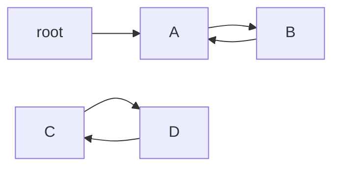

# F04 Understand GC through Reference Graphs

[English](F04-gc-from-graphs.md) · [中文](../../foundations/F04-先看引用图再理解垃圾回收.md)

## First ask what can still reach the object

Represent objects as nodes and references as directed edges. The roots are starting points for analysis, not a business object named Root or just a single variable in main. References needed by executing threads, class-related retention, and native global references can participate in keeping objects alive.

Our teaching graph is root → A → B → A, alongside C → D → C. The A/B cycle connects to the root; the C/D cycle does not. Mutual references alone do not make a group immortal.



The actual Map below retains all its strings and lists. We analyze a **model graph represented by strings**. We are not claiming that the JVM will reclaim the C and D strings held by this Map. This is a graph-traversal experiment.

## Walk the marking model by hand

The queue starts with root. Removing root marks it seen and queues A. Removing A queues B. Removing B finds A again, but the visited set prevents another expansion, so traversal terminates. C and D are never enqueued from the root and do not appear in the result.

The seen set records visited nodes and prevents cycles from causing infinite traversal. A real GC must also handle concurrent mutations, reference kinds, and possibly object movement. This model explains only the initial reachability idea.

## Complete code

Save as `Foundation04.java`.

```java
import java.util.ArrayDeque;
import java.util.HashSet;
import java.util.Map;
import java.util.Set;
public class Foundation04 {
    static Set<String> reachable(Map<String, java.util.List<String>> edges, String root) {
        Set<String> seen = new HashSet<>();
        ArrayDeque<String> pending = new ArrayDeque<>();
        pending.add(root);
        while (!pending.isEmpty()) {
            String node = pending.removeFirst();
            if (seen.add(node)) pending.addAll(edges.getOrDefault(node, java.util.List.of()));
        }
        return seen;
    }
    public static void main(String[] args) {
        Map<String, java.util.List<String>> graph = Map.of(
            "root", java.util.List.of("A"),
            "A", java.util.List.of("B"),
            "B", java.util.List.of("A"),
            "C", java.util.List.of("D"),
            "D", java.util.List.of("C"));
        Set<String> live = reachable(graph, "root");
        if (!live.equals(Set.of("root", "A", "B"))) throw new AssertionError(live);
        System.out.println("reachable objects=" + (live.size() - 1));
        System.out.println("unreachable cycle=" + (!live.contains("C") && !live.contains("D")));
    }
}
```

## Compile and run

```bash
javac --release 17 -encoding UTF-8 Foundation04.java
java -cp . Foundation04
```

Expected output:

```text
reachable objects=2
unreachable cycle=true
```

## After marking, how does space become usable?

Imagine abstract memory containing A, dead X, B, dead Y. Marking identifies survivors but does not decide how to reuse the holes.

| Basic approach | Treatment of this space | Cost to consider |
| --- | --- | --- |
| Mark and sweep | Retain A/B and record X/Y as free space | Fragmentation and finding suitable free blocks |
| Copy survivors | Move A/B to another space | Destination capacity and correct reference handling |
| Mark and compact | Move survivors to make free space more contiguous | Movement and reference-maintenance work |

These are algorithmic ideas, not a strict one-to-one mapping from each collector product to one table cell. A **collector** combines algorithms, concurrency mechanisms, partitioning, and scheduling.

## Generations and pauses

Many objects become unused quickly, while a smaller set survives much longer. This observation motivates generational strategies. Young generation does not mean a permanent location for every new object, and promotion is not universally “after exactly fifteen collections.” Collector policy, object size, and space conditions matter.

If an old object points to a young one, examining only the young region can miss the incoming edge. Remembered sets and card tables help locate cross-region references. They are not another unbounded storage area for business objects.

Stop-the-world means application threads pause for a phase. Parallel GC work uses several collector threads; concurrent work overlaps with application execution. A concurrent collector may still have stop-the-world phases.

## An initial collector map

Serial, Parallel, G1, and ZGC name implementations, not four spellings of System.gc. Compare goals such as throughput, latency, and resource cost, check the chosen JDK and platform, then measure equivalent workloads. This series chooses G1 explicitly for reproducibility, not as a universal recommendation. Do not copy obsolete collector flags from historical material into a new runtime.

**Exercises and answers:** adding root → C makes all four modeled objects reachable. Removing root → A makes A/B unreachable despite their cycle. Only then proceed to Chapter 08's weak references: those introduce special processing rules beyond the basic reachability model.

---

[Previous: Trace Frames and Read a Class File](F03-read-bytecode.md) · [Contents](../../README.md) · [Next: Separate Memory Exhaustion, Leaks, and GC Pressure](F05-memory-failures.md)
