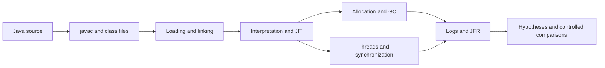

# 00 Introduction and Learning Path

[English](00-introduction.md) · [中文](../../tutorial/00-导读与学习路线.md)

This series is for readers who can write Java and want to understand the JVM through experiments. Starting with the class file for an order calculation, we explore types, loading, invocation, memory, synchronization, compilation, and diagnostics before fixing an unbounded cache.

The goal is a reviewable chain of evidence: source code poses a question, bytecode explains compilation, execution checks behavior, and logs test implementation hypotheses. A successful run does not prove the absence of a data race. A timing difference does not by itself prove that a particular JIT optimization occurred.

## If this is your first JVM course

Start with the [beginner route](beginner-guide.md). Read F01–F03 if references or operand stacks are unfamiliar, F04–F05 before GC, and F06 before concurrency. The sidebar groups them as foundations without renumbering existing chapters.

## Environment and first steps

Use a complete JDK 17, not just a runtime. Ensure java, javac, javap, jar, jcmd, and jfr come from the same JDK. Basic verification also requires Python 3.9 or newer.

```bash
java -version
javac -version
python3 tools/verify_article_code.py
```

Chapters 01–18 each include a complete standalone Java program, commands, expected output, and exercises. Save the code as DemoNN.java to run it independently. Chapter 17 first packages an agent as shown in the article. Matching sources are provided in examples; verification checks both language editions against those sources.

## Learning path

| Stage | Chapters | Questions you should be able to answer |
| --- | --- | --- |
| Execution and types | 01–07 | How do bytecode, type identity, invocation, and exceptions fit together? |
| Memory and concurrency | 08–12 | What retains an object, when is it collectible, and how is cross-thread ordering established? |
| Optimization and measurement | 13–15 | What is an optimization candidate, and what evidence supports a performance claim? |
| Diagnostics and practice | 16–18 | How do we gather evidence, load an agent, and repair retention by a cache? |
| Extension boundaries | 19 | What roles do annotation processing, JNI, Graal, Truffle, and AOT play? |



## How to use a chapter

Predict the output, run the program, and explain any difference. Inspect bytecode with javap, GC with an explicit heap configuration, and compilation with diagnostic output. For concurrency, establish the synchronization relationships before using execution as supporting evidence.

Expected outputs contain only stable observations. Addresses, thread schedules, collection counts, compilation times, and nanosecond timings are not presented as portable constants. Additional logging commands describe separate experiments from the default correctness run.

## Version and implementation boundaries

The baseline is HotSpot on JDK 17. Java language rules, JVM specification rules, and HotSpot implementation details are distinct layers. Record distribution, version, architecture, and options when discussing implementation behavior. Recheck reflection, locks, and collectors on newer JDKs rather than extrapolating old thresholds.

This series does not implement a complete JVM or present the teaching cache as a production cache. Chapter 19 discusses mechanisms and a design case; it does not ship runnable Native Image, JNI, or custom annotation-processor projects. JMH is a separate optional Maven project. Its verified scope is documented in the validation appendix.

---

[Contents](../../README.md) · [Next: From Source Code to Bytecode](01-source-to-bytecode.md)
