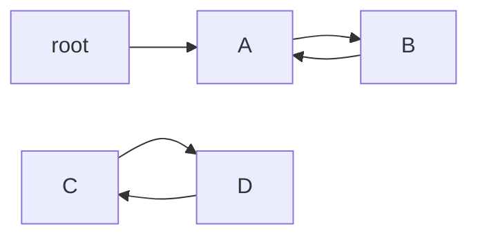

# F04 先看引用图再理解垃圾回收

[English](../en/foundations/F04-gc-from-graphs.md) · [中文](F04-先看引用图再理解垃圾回收.md)

## 回收器先回答“还有谁能到达它”

把对象想成图中的节点，把引用想成有方向的边。根集合是分析的出发点；它不是一个叫 Root 的业务对象，也不是单指 main 方法里的一个变量。正在执行的线程所需引用、类相关的持有关系、本地全局引用等都可能参与存活关系。

本篇用字符串画一张教学图：root → A → B → A，同时 C → D → C。A、B 构成的环与根相连；C、D 的环没有根路径。所以“互相引用”不是“永远不会回收”的理由。



请注意：下面程序里的 Map 真正持有了所有字符串与列表。我们分析的是字符串代表的**模型对象图**，不是声称 JVM 此时会回收 Map 中的 C、D 字符串。它是一个图遍历算法实验。

## 手工走一遍标记过程

待处理队列开始只有 root。取出 root，记为已见，把 A 加入队列；取出 A，加入 B；取出 B，又看见 A，但 A 已处理过，不再重复展开。因此遍历会结束。C、D 没有从根被加入队列，它们不在结果中。

seen 集合有两个作用：保存已访问节点，也避免环导致无限遍历。现实 GC 还要处理并发写入、引用种类、对象移动等问题，这个模型只解释最基础的“由根追踪可达对象”。

## 完整代码

保存为 `Foundation04.java`.

```java
import java.util.ArrayDeque;
import java.util.HashSet;
import java.util.Map;
import java.util.Set;
public class Foundation04 {
    static Set<String> reachable(Map<String, java.util.List<String>> edges, String root) {
        Set<String> seen = new HashSet<>();
        ArrayDeque<String> pending = new ArrayDeque<>();
        pending.add(root);
        while (!pending.isEmpty()) {
            String node = pending.removeFirst();
            if (seen.add(node)) pending.addAll(edges.getOrDefault(node, java.util.List.of()));
        }
        return seen;
    }
    public static void main(String[] args) {
        Map<String, java.util.List<String>> graph = Map.of(
            "root", java.util.List.of("A"),
            "A", java.util.List.of("B"),
            "B", java.util.List.of("A"),
            "C", java.util.List.of("D"),
            "D", java.util.List.of("C"));
        Set<String> live = reachable(graph, "root");
        if (!live.equals(Set.of("root", "A", "B"))) throw new AssertionError(live);
        System.out.println("reachable objects=" + (live.size() - 1));
        System.out.println("unreachable cycle=" + (!live.contains("C") && !live.contains("D")));
    }
}
```

## 编译与运行

```bash
javac --release 17 -encoding UTF-8 Foundation04.java
java -cp . Foundation04
```

预期输出：

```text
reachable objects=2
unreachable cycle=true
```

## 标记完之后，空间怎样重新利用

假设一段抽象内存按顺序放着 A、垃圾 X、B、垃圾 Y。标记只告诉我们谁存活，并不自动决定空洞怎样被再利用。

| 基本思路 | 对这段空间做什么 | 换来的成本 |
| --- | --- | --- |
| 标记后清扫 | 留住 A、B，把 X、Y 对应空间记为空闲 | 可能留下碎片，后续分配要找到合适空间 |
| 复制存活对象 | 把 A、B 搬到另一段空间 | 需要目标空间，引用需要正确处理 |
| 标记后整理 | 按某种安排移动存活对象，使空闲空间更连续 | 移动与引用维护有成本 |

这是算法层的比较，不是“Serial 等于一个表格格子、G1 等于另一个”的严格产品映射。**收集器**是把算法、并发机制、分区、调度等组合起来的实现。

## 年轻代、老年代与暂停从哪里来

很多对象很快失去用途，少量对象长期存活，这是分代策略的经验依据。年轻代不是“刚执行 new 的全部对象永远所在的位置”，晋升规则也不能简化成固定存活 15 次。收集器、大小与当前空间条件都会影响策略。

若老对象有一条边指向年轻对象，只扫描年轻代会漏掉这条进入边。记忆集、卡表等机制用于帮助定位跨区域引用；它们不是另一种可以无限存放业务对象的堆。

STW 表示某个阶段应用线程需要暂停。并行是多个 GC 线程协同工作；并发是 GC 工作与应用执行存在重叠。并发收集器仍可能有 STW 阶段，不能把两个词当成“完全没有暂停”。

## 收集器的第一张选型地图

Serial、Parallel、G1、ZGC 是实现名称，不是 `System.gc()` 的四种拼写。了解它们时，先问优先目标是吞吐、暂停还是资源占用，支持哪些 JDK 与平台，再做同负载测量。本系列明确选 G1 便于复现，不代表它对所有服务最合适。不要把旧资料中已经退出目标版本的选项直接复制过来。

**练习与答案：**在模型中增加 root → C 后，可达业务节点变为四个；删除 root → A 后，A、B 即使互相引用也不可达。下一步再读主线 08 的弱引用：那是更特殊的引用处理规则，不是入门时判活的全部起点。

---

[上一篇: 亲手推演栈帧与class文件](F03-亲手推演栈帧与class文件.md) · [目录](../README.zh-CN.md) · [下一篇: 分清内存溢出泄漏与GC压力](F05-分清内存溢出泄漏与GC压力.md)
