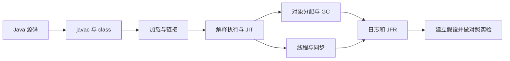

# 00 导读与学习路线

[English](../en/tutorial/00-introduction.md) · [中文](00-导读与学习路线.md)

这套系列面向能编写 Java 程序、希望从实验理解 JVM 的读者。我们从一段订单计算代码的 class 文件开始，依次研究类型、加载、调用、内存、同步、编译与诊断，最后解决一个无界缓存问题。

学习重点是建立可复查的证据链：源码提出问题，字节码解释编译结果，运行实验检查行为，日志与诊断工具验证实现假设。一次运行成功不能证明没有数据竞争；一次耗时变化也不能证明某个 JIT 优化发生。

## 第一次学 JVM 的读法

先看[新手路线](新手学习路线与补齐说明.md)。如果不知道引用与对象的区别、无法手算操作数栈，先读 F01—F03；读 GC 前完成 F04—F05，读并发前完成 F06。它们位于目录的“先修课”分组，不改变原有章节编号。

## 环境与开始方式

使用完整的 JDK 17，而非只有运行时的环境。确认 java、javac、javap、jar、jcmd、jfr 来自同一套 JDK。基础验证还需要 Python 3.9 或更高版本。

```bash
java -version
javac -version
python3 tools/verify_article_code.py
```

每篇 01—18 都包含完整的单文件 Java 程序、命令、预期结果和练习。把代码保存为 DemoNN.java 后即可独立运行；第 17 篇需要按正文先打包为 agent。examples 中提供相同源码，验证器会检查其与正文一致。

## 四条学习路线

| 阶段 | 篇章 | 完成后应该能回答 |
| --- | --- | --- |
| 执行与类型 | 01—07 | 字节码如何表达运算，类身份、调用与异常如何确定 |
| 内存与并发 | 08—12 | 谁持有对象，何时能回收，跨线程如何建立顺序 |
| 优化与测量 | 13—15 | 什么是优化候选，什么证据才足以支持性能结论 |
| 诊断与综合 | 16—18 | 如何取证、安装 agent、修复缓存保留问题 |
| 扩展边界 | 19 | 注解处理器、JNI、Graal、Truffle、AOT 分别解决什么问题 |



## 怎样读每一篇

先预测输出，再运行，最后解释差异。对字节码使用 javap；对 GC 使用带明确堆配置的日志；对编译使用诊断输出；对并发先画同步关系，再用实验辅助理解。

每篇的稳定输出都只包含能可靠验证的内容。对象地址、线程调度顺序、回收次数、编译时间和纳秒耗时不写成跨平台固定值。带日志的补充命令与默认验证命令是两组不同实验。

## 版本与实现边界

基线是 JDK 17 上的 HotSpot。Java 语言规范、JVM 规范和 HotSpot 实现是三个层次。涉及实现细节时，应记录 JDK 发行版、版本、架构与选项。新版 JDK 的反射、锁和收集器实现需要重新核对，不能从旧课程的阈值直接推导。

本系列不实现完整 JVM，也不把教学缓存当作生产缓存。第 19 篇是概念与设计案例，未提供 Native Image、JNI 或自定义注解处理器的可执行项目。JMH 是独立的可选 Maven 工程；它的构建和实测状态见验证记录。

[开始第一篇](01-从源码追到字节码.md) · [返回目录](../README.zh-CN.md)

---

[目录](../README.zh-CN.md) · [下一篇：从源码追到字节码](01-从源码追到字节码.md)
